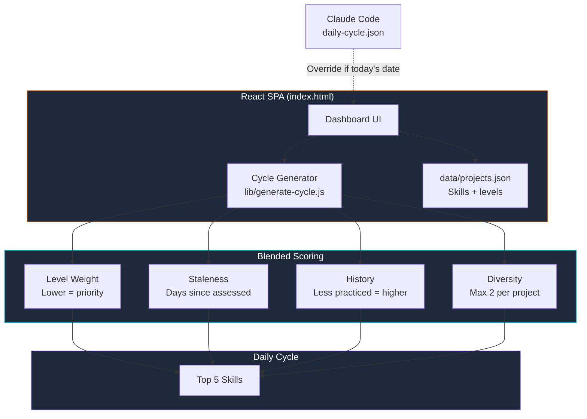

# SKILLGENOME

[](https://github.com/effecet/genome-evolve-dashboard/actions/workflows/vitest.yml)
[](https://github.com/effecet/genome-evolve-dashboard/actions/workflows/gitleaks.yml)
[](LICENSE)
[](https://nodejs.org)
[](https://vitest.dev)
[](https://react.dev)
[](https://mermaid.js.org)

Personal skill genome tracker with auto-generated daily practice cycles.

## Architecture



## Quick Start

```bash
make install   # install test dependencies
make serve     # serve at localhost:8080
```

Open `index.html` in a browser (or use `make serve` for full functionality).

## How It Works

The dashboard auto-generates a daily 5-skill practice cycle using a **blended scoring algorithm**:

- **Level weight** — lower-level skills get priority (growth potential)
- **Staleness** — skills not assessed recently bubble up
- **History** — less-practiced skills score higher
- **Diversity** — max 2 skills per project to spread practice

If a Claude Code-generated `data/daily-cycle.json` exists with today's date, it takes priority (AI-curated). Otherwise, the client-side generator kicks in automatically on page load.

## Development

```bash
make test          # run tests
make test-watch    # watch mode
make test-coverage # with coverage report
```

## Project Structure

```
index.html           # React SPA (standalone, CDN dependencies)
lib/
  generate-cycle.js  # Cycle generation algorithm (UMD — browser + Node)
data/
  projects.json      # Source of truth: projects and skills
  session-log.json   # Auto-tracked activity feed
tests/
  generate-cycle.test.js  # Vitest tests (27 cases)
```

## Configuration

Cycle generation accepts options:

| Option | Default | Description |
|--------|---------|-------------|
| `date` | today | Reference date (YYYY-MM-DD) |
| `count` | 5 | Skills per cycle |
| `maxPerProject` | 2 | Diversity cap per project |
